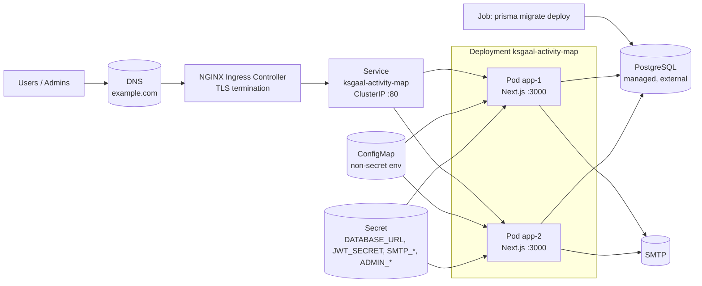
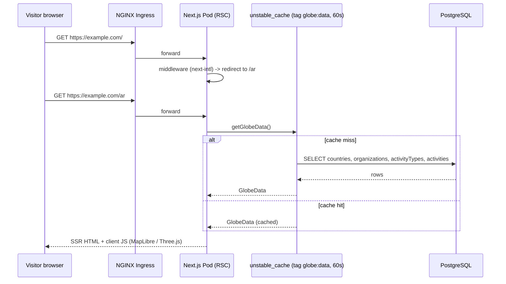
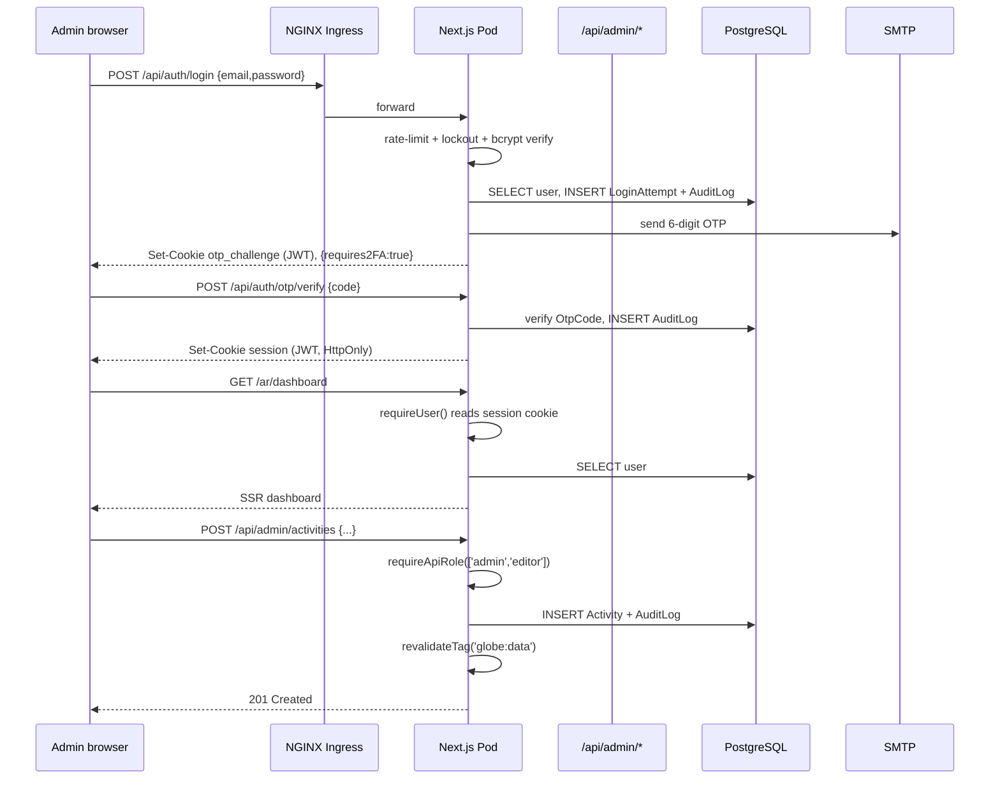
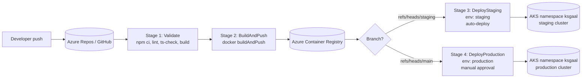

# Deployment — Kubernetes

This document describes how `ksgaal-activity-map` is deployed to Kubernetes
(target: Azure AKS with the ingress-nginx controller) and how Azure DevOps
builds and ships the image.

## Architecture at a glance

- **Single Next.js 16 app** (App Router). Public website, admin dashboard,
  and all `/api/**` routes run in the **same** Node process.
- **No separate backend service.** The admin dashboard lives at
  `/[locale]/dashboard/**` inside the same Next.js app and is protected
  by a session cookie issued by `/api/auth/login` (password + email OTP 2FA).
- **PostgreSQL is external** — in production it is a managed database
  (e.g. Azure Database for PostgreSQL Flexible Server). The pods themselves
  are stateless.
- **SMTP is required in production** for OTP emails and password-reset links.
- **Docker Compose is for local testing only** (see `docker-compose.yml`).
  Kubernetes is the production deployment model.

## Runtime architecture

## Public request flow

## Admin request flow

## Azure DevOps deployment flow

Each deploy stage:

1. Substitutes `ACR_LOGIN_SERVER` and `IMAGE_TAG` placeholders in
   `k8s/deployment.yaml` and `k8s/migration-job.yaml`.
2. Creates/updates the Secret from Azure DevOps variable group
   (linked to Key Vault).
3. Applies namespace + ConfigMap + Service + Ingress.
4. Runs `prisma migrate deploy` as a Kubernetes Job and waits for it to
   complete.
5. Applies the Deployment and waits for the rollout to finish.

## Health probes

- **Liveness:** `GET /api/health/live` — static 200, no DB.
- **Readiness:** `GET /api/health/ready` — runs `SELECT 1` against
  PostgreSQL; returns 503 if unreachable.
- The pre-existing `/api/admin/health` endpoint requires a session cookie
  and **must not** be used as a probe.

## What lives where

| Concern | Where |
|---|---|
| Non-secret env (URLs, SMTP host, public vars) | `k8s/configmap.yaml` |
| Secret env (DB URL, JWT, SMTP creds, admin seed) | K8s Secret created from Azure Key Vault / DevOps secret variables |
| Image | Azure Container Registry, tag = `$(Build.BuildId)` |
| TLS cert | Secret `ksgaal-tls` in `ksgaal` namespace (cert-manager or manual) |
| Migrations | One-shot Job per release, runs `npx prisma migrate deploy` |

## Local testing vs production

| | Local (`docker compose up`) | Production (K8s) |
|---|---|---|
| Database | `postgres:16-alpine` container | Managed PostgreSQL (e.g. Azure DB for PostgreSQL) |
| SMTP | Mailpit (`localhost:8025`) | Real SMTP provider |
| Secrets | Hard-coded in compose file (placeholders) | Kubernetes Secret from Azure Key Vault |
| HA | Single replica | 2+ replicas, rolling updates |
| TLS | None (HTTP on `localhost:3000`) | Ingress + cert-manager |

Use Docker Compose to smoke-test the production image locally. Never use it
to host the live app.
